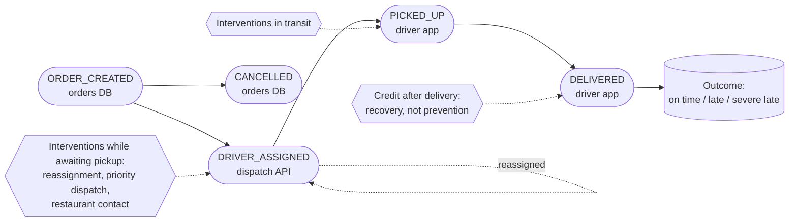
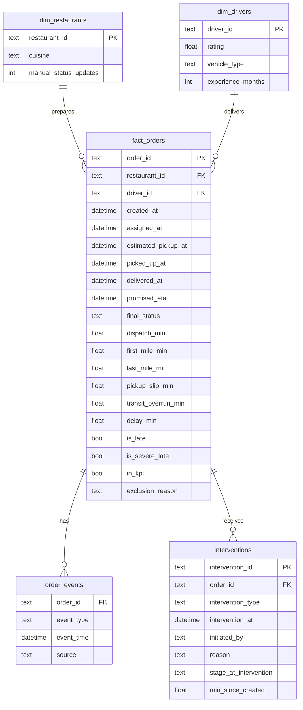
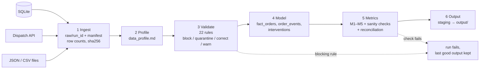

# Workflow and data model

## 1. Order workflow (states, events, where each fact comes from)



The promise is built from two planned legs. Comparing each leg with what actually happened
shows where the delay came from:

```
created ──(planned 18 min)──► estimated_pickup ──(planned transit)──► promised_eta
created ──(actual)──────────► picked_up ─────────(actual transit)───► delivered

delay_min       = delivered − promised_eta
                = pickup_slip_min                   + transit_overrun_min
                = (picked_up − estimated_pickup)    + (actual transit − planned transit)
```

## 2. Relational model (`output/model.db`)



- **Entities:** order, restaurant, driver.
- **Events and states:** `order_events` puts every system's events into one shape (`order_id, event_type, event_time, source`).
- **Interventions:** each one is tagged with the stage the order was in at that moment.
- **Outcomes:** `delay_min`, `is_late` and `is_severe_late` on `fact_orders`.

## 3. Pipeline


